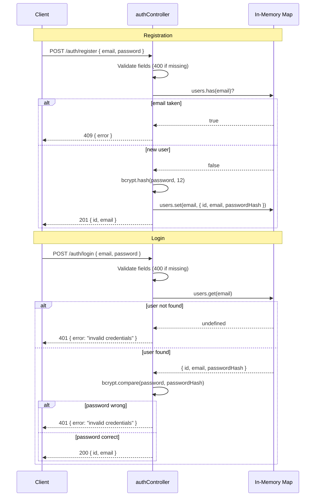

# Auth API

The Auth API handles user registration and credential-based login. Passwords are hashed with **bcrypt** (salt rounds = 12) before storage.

## Base URL

```
/auth
```

:::note Demo Implementation
The current auth controller uses an in-memory `Map` as its user store. Registered users do not persist between server restarts. There is no JWT issuance yet — this is a training exercise hook.
:::

---

## Endpoints

### Register

Creates a new account with an email and password.

```
POST /auth/register
```

#### Request Body

```json
{
  "email": "alice@example.com",
  "password": "s3cureP@ssw0rd"
}
```

| Field | Type | Required | Rules |
|---|---|---|---|
| `email` | `string` | Yes | Non-empty string |
| `password` | `string` | Yes | Non-empty string; hashed before storage |

#### Responses

##### 201 Created

```json
{
  "id": "550e8400-e29b-41d4-a716-446655440000",
  "email": "alice@example.com"
}
```

:::caution Password never returned
The plaintext password and `passwordHash` are **never** included in any response.
:::

##### 400 Bad Request

```json
{ "error": "email and password are required" }
```

##### 409 Conflict

```json
{ "error": "email already registered" }
```

---

### Login

Verifies credentials and returns the user identity.

```
POST /auth/login
```

#### Request Body

```json
{
  "email": "alice@example.com",
  "password": "s3cureP@ssw0rd"
}
```

#### Responses

##### 200 OK

```json
{
  "id": "550e8400-e29b-41d4-a716-446655440000",
  "email": "alice@example.com"
}
```

##### 400 Bad Request

```json
{ "error": "email and password are required" }
```

##### 401 Unauthorized

Returned for both "user not found" and "wrong password" (intentionally ambiguous to prevent user enumeration):

```json
{ "error": "invalid credentials" }
```

---

## Authentication Flow



---

## Usage Examples

### Register

```bash
curl -X POST http://localhost:3000/auth/register \
  -H "Content-Type: application/json" \
  -d '{"email": "alice@example.com", "password": "s3cureP@ssw0rd"}'
```

### Login

```bash
curl -X POST http://localhost:3000/auth/login \
  -H "Content-Type: application/json" \
  -d '{"email": "alice@example.com", "password": "s3cureP@ssw0rd"}'
```

---

## Security Notes

| Concern | Current behaviour | Recommended for production |
|---|---|---|
| Password storage | bcrypt, 12 salt rounds | Same — keep 12+ rounds |
| Session / token | None issued | Add JWT with expiry |
| User enumeration | Login returns `"invalid credentials"` for both missing user and wrong password | ✅ Already mitigated |
| Brute-force protection | None | Add rate limiting (`express-rate-limit`) |
| HTTPS | Not enforced | Enforce via reverse proxy / TLS termination |

## Module 4.5: Refactoring Exercise

The password hashing logic inside `auth.controller.ts` is intentionally **inlined** for a refactoring exercise:

1. Extract `bcrypt.hash` / `bcrypt.compare` into `src/services/password-service.ts`
2. Update the controller to import from the new service
3. Write unit tests for the password service in `password-service.test.ts`

See the inline comment in `auth.controller.ts` for the exact extraction targets.
