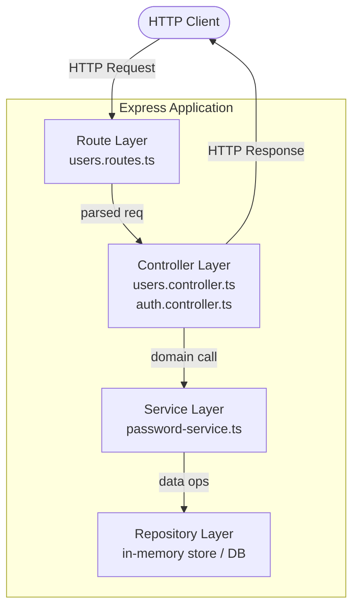
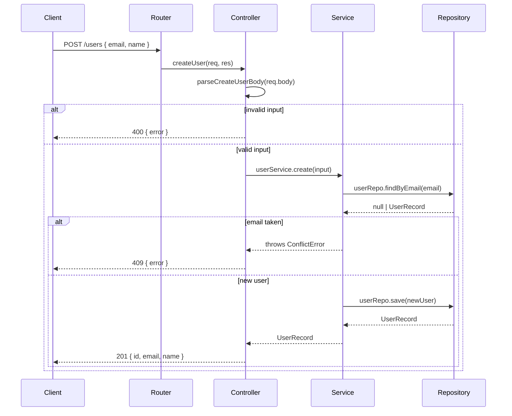
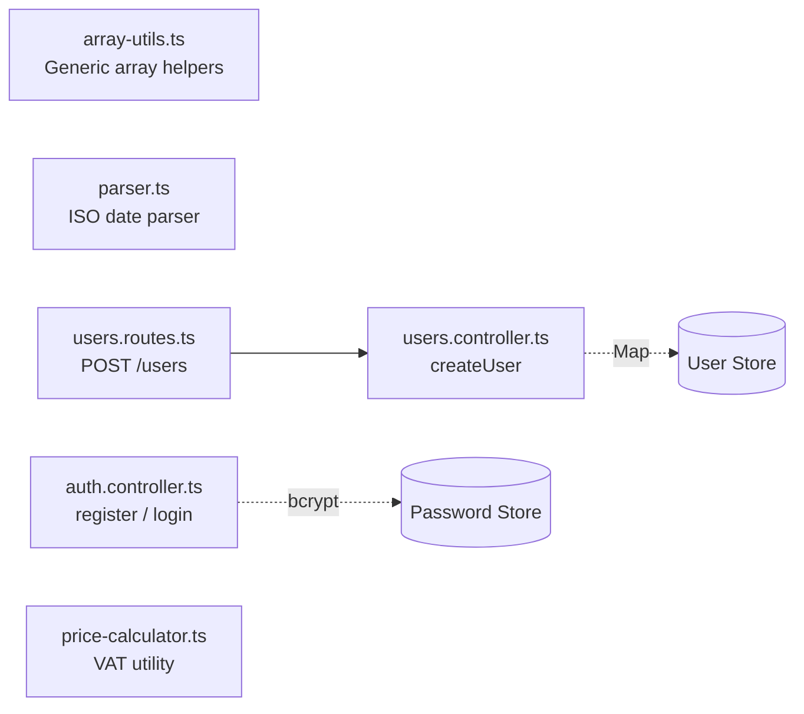

# Architecture Overview

## Design Philosophy

node-demo follows a **strict layered architecture** where each layer has one responsibility and depends only on the layer directly below it. This keeps business logic isolated, testable, and independent of transport concerns.

## Layer Diagram



## Layer Responsibilities

### Route Layer
- Registers URL paths and HTTP methods on an Express `Router`
- No logic — only wires paths to controller functions
- Example: `users.routes.ts`

```typescript
const router = Router();
router.post('/users', createUser);
```

### Controller Layer
- Parses and validates the incoming request
- Calls the relevant service function
- Formats and sends the HTTP response
- **No business logic**

```typescript
export async function createUser(req: Request, res: Response) {
  const input = parseCreateUserBody(req.body);
  if (!input) return res.status(400).json({ error: 'name and email are required' });
  // delegate to service...
}
```

### Service Layer
- Contains all business logic
- Throws domain errors (never touches `req` or `res`)
- Calls the repository for data access

### Repository Layer
- Pure data access — no business rules
- Abstracts the underlying storage (in-memory `Map`, database, external API)
- Current implementation uses in-memory `Map` stores for demo simplicity

## Request Lifecycle



## Module Overview



## Key Design Decisions

| Decision | Rationale |
|---|---|
| ESM (`"type": "module"`) | Aligns with the Node.js future, avoids dual-module hazard |
| `Map` as in-memory store | Simple, fast, no DB setup required for training demos |
| `crypto.randomUUID()` | Native API — no `uuid` package needed in Node 20+ |
| Pino for logging | Structured JSON output, minimal overhead, production-grade |
| Vitest over Jest | Native ESM support, faster HMR, compatible with the toolchain |
| bcrypt salt rounds = 12 | Balanced security vs. latency for auth demos |

## Future Extension Points

As you grow the project beyond training exercises, consider:

1. **Replace `Map` stores** with a real repository backed by PostgreSQL or MongoDB
2. **Add Zod schemas** in `src/schemas/` for request validation
3. **Extract `asyncHandler` middleware** to wrap async controllers uniformly
4. **Add a service layer** between the current controllers and the in-memory stores
5. **Introduce JWT** for stateless auth instead of the session-less demo setup
