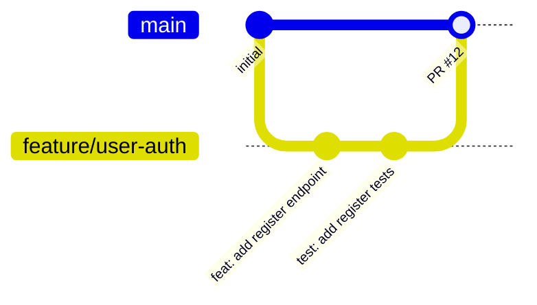

# Contributing Guidelines

## Getting Started

1. Fork the repository (external contributors) or create a branch (team members)
2. Follow the [Installation guide](../getting-started/installation.md)
3. Read [Coding Standards](./coding-standards.md) before writing any code
4. Open a PR against `main` when ready

---

## Branching Strategy

### Branch naming

```text
feature/<short-description>    # new functionality
fix/<short-description>        # bug fixes
refactor/<short-description>   # code improvements
docs/<short-description>       # documentation only
chore/<short-description>      # tooling, CI, dependency updates
test/<short-description>       # tests only
```

Examples:

```text
feature/user-authentication
fix/login-validation
refactor/extract-password-service
docs/api-setup
```

### Branch lifecycle



- **Never push directly to `main`** — always use a PR
- Rebase on `main` before opening a PR to reduce merge conflicts
- Delete branches after merging

---

## Commit Messages

Follow the [Conventional Commits](https://www.conventionalcommits.org/) spec:

```
type(scope): short imperative description

[optional body]

[optional footer: BREAKING CHANGE or closes #issue]
```

### Allowed types

| Type | When |
|---|---|
| `feat` | New feature |
| `fix` | Bug fix |
| `chore` | Tooling, CI, dependencies |
| `docs` | Documentation only |
| `refactor` | Code change that doesn't fix a bug or add a feature |
| `test` | Adding or updating tests |

### Examples

```text
feat(auth): add login endpoint with bcrypt verification
fix(users): normalise email case before deduplication check
test(price-calculator): add negative rate edge case
refactor(auth): extract password hashing to password-service
docs(readme): update getting started steps
chore(deps): bump vitest to 2.1.0
```

---

## Pull Request Process

### Before opening a PR

- [ ] `npm run typecheck` — no type errors
- [ ] `npm test` — all tests pass
- [ ] No `console.log` or `console.error` in source code
- [ ] No `as any` without a TODO
- [ ] Branch is up to date with `main`

### PR description template

```markdown
## Summary
Brief description of what this PR does.

## Changes
- List of specific changes made

## Testing
How you tested these changes (test names, manual steps, etc.)

## Related issues
Closes #<issue-number>
```

### Review process

1. At least **one approval** required before merging
2. Address all review comments before merging
3. Use **Squash and merge** for feature branches to keep history clean
4. Use **Merge commit** for release branches

---

## Adding a New Training Exercise

Each exercise file should:

1. Be self-contained (minimal cross-file dependencies)
2. Include a comment at the top describing the exercise goal
3. Include deliberate hooks (bugs, TODOs, refactoring targets) that Copilot can act on
4. Have a corresponding `*.test.ts` file

### Template

```typescript
// Exercise: <Exercise Name>
// Goal: <What the developer should accomplish>
// Copilot hint: <What prompt or command works well here>

/**
 * <Function description>
 */
export function myExerciseFunction(): void {
  // TODO: implement me
}
```

---

## Release Process

This project follows **semantic versioning** (`MAJOR.MINOR.PATCH`):

| Increment | When |
|---|---|
| `PATCH` | Bug fixes, no API change |
| `MINOR` | New backwards-compatible features |
| `MAJOR` | Breaking changes |

### Tagging a release

```bash
git tag -a v1.1.0 -m "chore(release): v1.1.0"
git push origin v1.1.0
```

---

## Questions and Support

For questions about the training exercises or project conventions, open a GitHub Discussion or contact the workshop facilitator.
