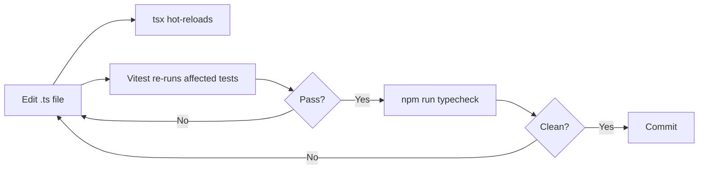

# Local Development

## Starting the Development Server

The project uses [tsx](https://github.com/privatenumber/tsx) for zero-config TypeScript execution with hot reload.

```bash
npm run dev
```

This starts `tsx watch src/index.ts`. Any change to a `.ts` file triggers an automatic restart.

:::note No `src/index.ts` yet?
The training repo ships without a full application entry point. The `dev` script is ready for you to add one. During exercises, you work with individual module files directly — run them with `tsx <file>` or exercise them through tests.
:::

## Running Individual Files

You can execute any TypeScript module directly with `tsx`:

```bash
npx tsx array-utils.ts
npx tsx parser.ts
```

## Tests

### Single run

```bash
npm test
```

### Watch mode (recommended during development)

```bash
npx vitest
```

Vitest stays active and re-runs only the affected test files when you save changes. This is the fastest inner feedback loop.

### Coverage report

```bash
npx vitest run --coverage
```

Coverage output appears in `coverage/` (HTML report at `coverage/index.html`).

## Type Checking

TypeScript type checking runs separately from tests:

```bash
npm run typecheck
```

Run this before committing to catch type errors that tests might not surface.

## Building for Production

```bash
npm run build
```

This runs `tsc` and emits JavaScript to `dist/`. Start the compiled output with:

```bash
npm start
# runs: node dist/index.js
```

## Recommended IDE Setup

### VS Code extensions

| Extension | Purpose |
|---|---|
| **ESLint** | In-editor linting |
| **Prettier** | Auto-format on save |
| **Vitest** | Run/debug tests inline |
| **TypeScript Error Translator** | Human-readable TS errors |

### VS Code settings (`.vscode/settings.json`)

```json
{
  "editor.formatOnSave": true,
  "editor.defaultFormatter": "esbenp.prettier-vscode",
  "typescript.preferences.importModuleSpecifier": "relative",
  "typescript.tsdk": "node_modules/typescript/lib"
}
```

## Linting and Formatting

:::info Not yet configured
The repo does not ship with ESLint or Prettier config files. Adding them is a recommended first exercise. See [Coding Standards](../developer-workflow/coding-standards.md) for conventions to encode.
:::

## Workflow Summary


