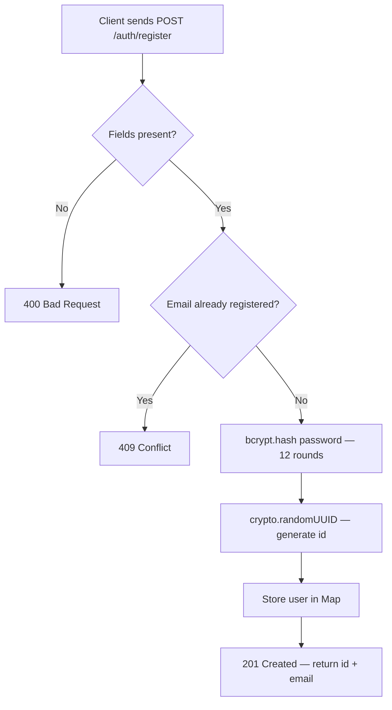
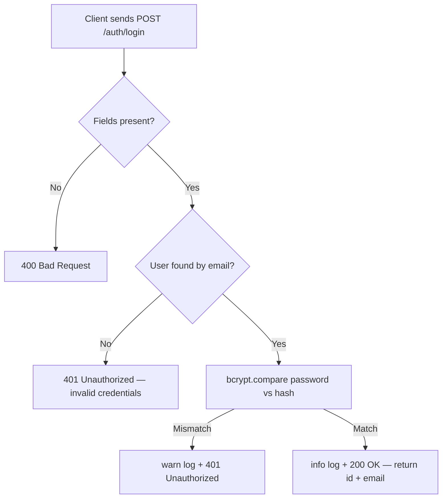

# Authentication Flow

## Overview

node-demo implements credential-based authentication with:

- **bcrypt** for secure password hashing (cost factor = 12)
- **In-memory store** as the user repository (demo only)
- **No session or token issuance** in the current implementation (see upgrade path below)

---

## Registration Flow



### Implementation

```typescript
register: async (req: Request, res: Response) => {
  const { email, password } = req.body as { email?: string; password?: string };

  if (!email || !password) {
    return res.status(400).json({ error: 'email and password are required' });
  }

  if (users.has(email)) {
    return res.status(409).json({ error: 'email already registered' });
  }

  const saltRounds = 12;
  const passwordHash = await bcrypt.hash(password, saltRounds);

  const id = crypto.randomUUID();
  users.set(email, { id, email, passwordHash });

  logger.info({ email }, 'User registered');
  return res.status(201).json({ id, email });
},
```

---

## Login Flow



### Implementation

```typescript
login: async (req: Request, res: Response) => {
  const { email, password } = req.body as { email?: string; password?: string };

  if (!email || !password) {
    return res.status(400).json({ error: 'email and password are required' });
  }

  const user = users.get(email);
  if (!user) {
    return res.status(401).json({ error: 'invalid credentials' });
  }

  const valid = await bcrypt.compare(password, user.passwordHash);
  if (!valid) {
    logger.warn({ email }, 'Login failed: bad password');
    return res.status(401).json({ error: 'invalid credentials' });
  }

  logger.info({ email }, 'User logged in');
  return res.status(200).json({ id: user.id, email: user.email });
},
```

---

## Security Considerations

### User enumeration prevention

Both "user not found" and "wrong password" return the same `401` response with the same message (`"invalid credentials"`). This prevents attackers from inferring which emails are registered.

### bcrypt cost factor

A cost factor of `12` is set as the default. At this level:

- A modern workstation can compute ~250 hashes/second
- An attacker with GPUs is limited by bcrypt's intentional slowness
- Legitimate logins complete in ~80–150 ms — acceptable UX

```typescript
const saltRounds = 12; // ~100ms on average hardware
```

:::tip Production note
At high login volume, bcrypt can become a CPU bottleneck. Consider moving to **Argon2** (via `argon2` npm package) which offers better resistance to GPU-based attacks and is the current OWASP recommendation.
:::

---

## Upgrade Path: Adding JWT

The current auth controller returns user identity but issues no token. To add stateless JWT authentication:

### 1. Install dependencies

```bash
npm install jsonwebtoken
npm install --save-dev @types/jsonwebtoken
```

### 2. Issue a token on login

```typescript
import jwt from 'jsonwebtoken';
import { config } from '../config.js';

// In login handler, after successful bcrypt.compare:
const token = jwt.sign(
  { sub: user.id, email: user.email },
  config.jwtSecret,
  { expiresIn: '1h' },
);

return res.status(200).json({ token });
```

### 3. Verify the token in a middleware

```typescript title="src/middleware/auth.middleware.ts"
import jwt from 'jsonwebtoken';
import type { Request, Response, NextFunction } from 'express';
import { config } from '../config.js';

export function requireAuth(req: Request, res: Response, next: NextFunction): void {
  const header = req.headers.authorization;
  if (!header?.startsWith('Bearer ')) {
    res.status(401).json({ error: 'missing token' });
    return;
  }

  try {
    const token = header.slice(7);
    const payload = jwt.verify(token, config.jwtSecret);
    (req as Request & { user: unknown }).user = payload;
    next();
  } catch {
    res.status(401).json({ error: 'invalid token' });
  }
}
```

---

## Module 4.5 Refactoring Target

The password hashing in `auth.controller.ts` is deliberately inlined. The extraction exercise involves:

1. Create `src/services/password-service.ts`
2. Export `hashPassword(plain: string): Promise<string>`
3. Export `verifyPassword(plain: string, hash: string): Promise<boolean>`
4. Update `auth.controller.ts` imports
5. Write `password-service.test.ts`
